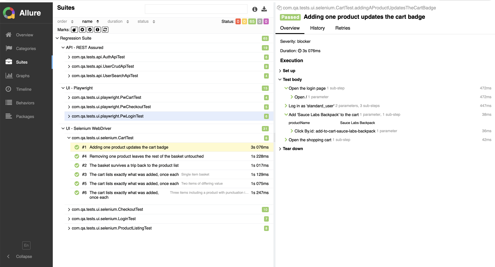
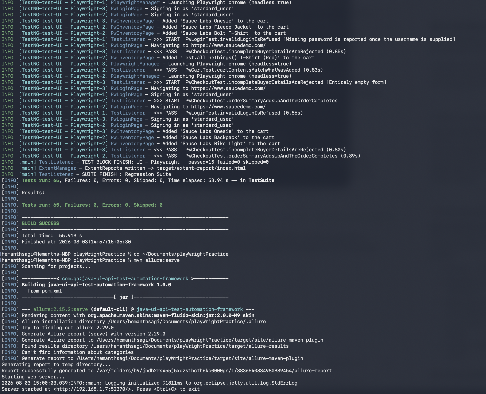
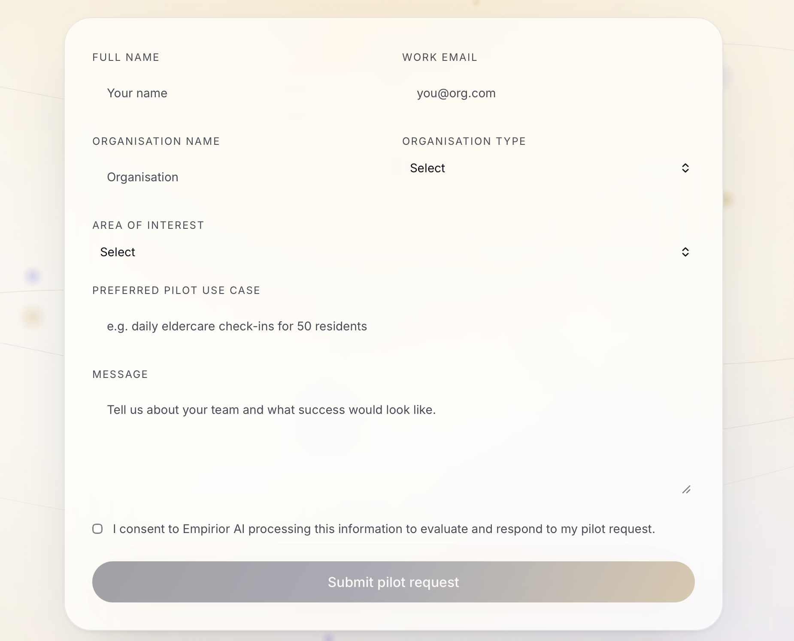
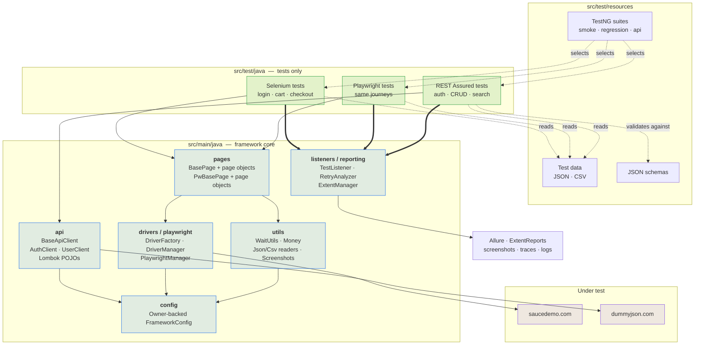
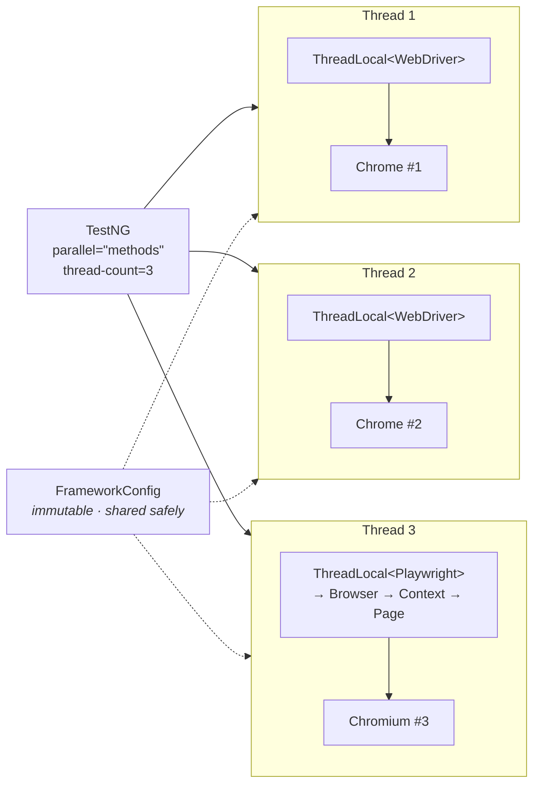

# Java UI + API Test Automation Framework

A production-grade test automation framework that drives the **same application through three
stacks** — Selenium WebDriver, Playwright-Java and REST Assured — under one Page Object
architecture, one configuration layer and one reporting pipeline.

[](https://openjdk.org/projects/jdk/17/)
[](https://maven.apache.org/)
[](https://testng.org/)
[](https://www.selenium.dev/)
[](https://playwright.dev/java/)
[](https://rest-assured.io/)
[](https://allurereport.org/)
[](https://extentreports.com/)

[](https://github.com/Hemanth-sagi/java-ui-api-test-automation-framework/actions/workflows/ci.yml)

---

## Contents

- [What this demonstrates](#what-this-demonstrates)
- [Screenshots](#screenshots)
- [Architecture](#architecture)
- [Project layout](#project-layout)
- [Getting started](#getting-started)
- [Running the tests](#running-the-tests)
- [What is covered](#what-is-covered)
- [Reporting](#reporting)
- [Design choices](#design-choices)
- [Continuous integration](#continuous-integration)
- [Extending the framework](#extending-the-framework)

---

## What this demonstrates

| | |
|---|---|
| **65 executable tests** | 19 API · 31 Selenium · 15 Playwright — all green against live public services |
| **Two UI engines, one architecture** | The same three journeys implemented in Selenium and Playwright, sharing config, data, reporting and page-object conventions |
| **Genuine assertions** | Checkout arithmetic (`total == subtotal + 8% tax`), search relevance, pagination boundaries, JSON schema contracts — not `assertNotNull` |
| **Parallel by construction** | `parallel="methods"` with every driver, browser context and page held in a `ThreadLocal` |
| **Data-driven** | Scenarios live in JSON and CSV files; adding a case needs no code change |
| **Evidence on failure** | Screenshot + Playwright trace + full request/response log, attached to both reports automatically |

Applications under test — both public, no credentials required:

- **UI:** [saucedemo.com](https://www.saucedemo.com) (Swag Labs storefront)
- **API:** [dummyjson.com](https://dummyjson.com) (JWT auth + users CRUD)

---

## Screenshots

> **📸 PLACEHOLDER — drop your images into `docs/images/` and they will render here.**
> The file names below are already referenced; just save your captures with these names.

<!-- ============================ PLACEHOLDER 1 ============================ -->
**Allure report — suite overview**

> Run `mvn test && mvn allure:serve`, screenshot the landing page, save as
> `docs/images/allure-overview.png`


<!-- ============================ PLACEHOLDER 2 ============================ -->
**Allure report — a test's step tree**

> Open any test and expand its steps (the `@Step`-annotated page-object methods), save as
> `docs/images/allure-test-detail.png`



<!-- ============================ PLACEHOLDER 3 ============================ -->
**Test run — the full suite passing in the terminal**

> Screenshot the tail of `mvn test` showing the `Tests run: 65, Failures: 0` summary, save as
> `docs/images/test-run.png`



<!-- ============================ PLACEHOLDER 4 ============================ -->
**ExtentReports — the shareable single-file HTML report**

> Open `target/extent-report/index.html`, screenshot, save as
> `docs/images/extent-report.png`



---

## Architecture

The rule the whole project follows: **`src/test/java` contains tests and nothing else.** Every
mechanism — waiting, driver lifecycle, HTTP, logging, reporting — lives in `src/main/java` and is
reused by all three stacks.



### Parallel execution model

Three TestNG worker threads each own a completely independent stack. Nothing is shared except
immutable configuration, which is why `thread-count` can be raised without touching a line of code.



---

## Project layout

```
java-ui-api-test-automation-framework/
├── pom.xml                                  # deps, profiles (env/browser/suite), surefire, Allure
├── .github/workflows/ci.yml                 # headless CI + Allure published to GitHub Pages
│
├── src/main/java/com/qa/framework/          # ── FRAMEWORK CORE (no tests here) ──
│   ├── config/
│   │   ├── FrameworkConfig.java             # typed, Owner-backed config interface
│   │   └── ConfigManager.java               # thread-safe loader, explicit precedence rules
│   ├── drivers/
│   │   ├── BrowserType.java                 # chrome | firefox | edge, validated on parse
│   │   ├── DriverFactory.java               # builds a configured WebDriver (WebDriverManager)
│   │   └── DriverManager.java               # ThreadLocal<WebDriver> lifecycle
│   ├── playwright/
│   │   └── PlaywrightManager.java           # ThreadLocal Playwright→Browser→Context→Page + tracing
│   ├── pages/
│   │   ├── BasePage.java                    # waits, clicks, reads — shared by all Selenium pages
│   │   ├── LoginPage · InventoryPage · CartPage
│   │   ├── CheckoutInformationPage · CheckoutOverviewPage · CheckoutCompletePage
│   │   └── playwright/                      # the same pages, Playwright-native (Pw* prefix)
│   ├── api/
│   │   ├── BaseApiClient.java               # request spec, bearer-token caching, Allure filter
│   │   ├── ApiEndpoints.java                # every path, in one place
│   │   ├── ApiLoggingFilter.java            # REST Assured traffic → Log4j2
│   │   ├── clients/  AuthClient · UserClient
│   │   └── models/   User · Address · UserListResponse · LoginRequest · LoginResponse (Lombok)
│   ├── utils/
│   │   ├── WaitUtils.java                   # the only place explicit waits are written
│   │   ├── Money.java                       # BigDecimal money parsing and arithmetic
│   │   ├── JsonDataReader · CsvDataReader   # typed test-data loading
│   │   └── ScreenshotUtils.java             # captures from whichever stack is live
│   ├── listeners/
│   │   ├── TestListener.java                # logging, screenshots, Allure/Extent attachments
│   │   ├── RetryAnalyzer.java · RetryTransformer.java
│   └── reporting/
│       └── ExtentManager.java
│
├── src/main/resources/
│   ├── config/{config,dev,staging}.properties
│   └── log4j2.xml
│
├── src/test/java/com/qa/tests/              # ── TESTS ONLY ──
│   ├── base/         BaseWebTest · BasePlaywrightTest · BaseApiTest
│   ├── ui/selenium/  LoginTest · ProductListingTest · CartTest · CheckoutTest
│   ├── ui/playwright/PwLoginTest · PwCartTest · PwCheckoutTest
│   ├── api/          AuthApiTest · UserCrudApiTest · UserSearchApiTest
│   ├── dataproviders/TestDataProviders.java
│   └── model/        typed rows for each data file
│
└── src/test/resources/
    ├── suites/       smoke.xml · regression.xml · api.xml
    ├── testdata/     login-scenarios.json · basket-scenarios.json · product-catalogue.json
    │                 api-new-users.json · checkout-customers.csv
    ├── schemas/      user · user-list · login-response · error
    └── allure.properties
```

---

## Getting started

### Prerequisites

| Requirement | Notes |
|---|---|
| **JDK 17+** | The build targets 17 via `maven.compiler.release`, and is verified green on both **JDK 17 and JDK 26** — Lombok and the AspectJ weaver are pinned to versions that work on current JDKs, which is the usual reason a framework like this fails to build on a reviewer's machine. |
| **Maven** *(optional)* | The repository ships the Maven wrapper — use `./mvnw` and no local install is needed. |
| **Chrome** (or Firefox/Edge) | Only for the Selenium tests. WebDriverManager downloads the matching driver automatically. |
| **Allure CLI** *(optional)* | Only needed for `allure serve` from the command line; the Maven plugin generates reports without it. |

Playwright needs **no manual setup** — it downloads its own browser on first run.

### Clone and verify

```bash
git clone https://github.com/Hemanth-sagi/java-ui-api-test-automation-framework.git
cd java-ui-api-test-automation-framework
./mvnw test
```

That runs the full regression suite headless: **65 tests in about a minute** on a laptop
(3 parallel threads). Every command below is written as `mvn`; substitute `./mvnw` if you would
rather not install Maven.

---

## Running the tests

### Suites

```bash
mvn test                    # regression — everything (default)
mvn test -Psmoke            # smoke — 8 critical tests across all three layers, under a minute
mvn test -Papi-only         # API only — no browser, ~10 seconds
```

### Browser and environment

```bash
mvn test -Dbrowser=firefox              # chrome (default) | firefox | edge
mvn test -Dheadless=false               # watch it run
mvn test -Pheaded                       # the same, via a profile
mvn test -Denv=staging                  # loads config/staging.properties
mvn test -Dthread.count=5               # widen parallelism
```

### Useful combinations

```bash
# Debug a UI failure: visible browser, single-threaded, slowed down, no retries
mvn test -Psmoke -Dheadless=false -Dthread.count=1 -Dretry.count=0 -Dplaywright.slowmo.ms=500

# Full regression on Firefox against staging
mvn test -Pregression,firefox -Denv=staging

# Pre-commit gate
mvn test -Papi-only
```

### Reports

```bash
mvn allure:serve                        # opens the Allure report in a browser
open target/extent-report/index.html    # the self-contained HTML report
```

Everything else lands in `target/`: `logs/automation.log`, `screenshots/`, `playwright-traces/`.
View a Playwright trace with:

```bash
npx playwright show-trace target/playwright-traces/<trace>.zip
```

---

## What is covered

### UI — Selenium (31 tests) and Playwright (15 tests)

| Journey | Assertions that matter |
|---|---|
| **Sign in** | Lands on the catalogue with 6 products and an empty cart |
| **Sign in — rejected** | Five data-driven cases assert the **exact** message, including that a wrong password and an unknown user produce identical text (no user enumeration) |
| **Locked-out account** | Refused even with the correct password, with a distinct message |
| **Catalogue** | Every product's advertised price matches the catalogue fixture; sorting by price and by name genuinely reorders the grid |
| **Basket** | Contents, line quantities and badge count match what was added; line prices sum to the expected subtotal |
| **Remove / continue shopping** | Removing one item leaves the others; the basket survives navigation |
| **Checkout — money** | `subtotal == Σ line prices`, `tax == 8% of subtotal`, `total == subtotal + tax` — all in `BigDecimal`, all reported together via `SoftAssert` |
| **Checkout — validation** | Four CSV-driven cases assert the field-specific message and that the shopper stays on the form |
| **Checkout — cancel** | Abandoning checkout preserves the basket |

### API — REST Assured (19 tests)

| Area | Assertions that matter |
|---|---|
| **Login** | 200 + JWT structure (3 segments) + profile identity, validated against `login-response-schema.json` |
| **Token handling** | `/auth/me` returns the caller; missing token → 401; malformed token → 401 with the documented message |
| **Wrong credentials** | 400, message reveals nothing about which field was wrong, and **no token is returned** |
| **Read** | 200 + full `user-schema.json` contract + populated nested address + response under 5 s |
| **Pagination** | `limit`/`skip` honoured and echoed; `total` describes the collection; consecutive pages **do not overlap** |
| **Create** | 201, id assigned, payload echoed intact — including a non-ASCII name and the boundary `age = 0` |
| **Update** | Submitted field changes, id preserved, untouched fields unchanged |
| **Delete** | 200, `isDeleted` flag, deletion timestamped |
| **Not found** | 404 + error schema + the message names the missing id |
| **Search** | **Every** result matches the query in some field — a search returning the whole table would fail |
| **Edge cases** | Empty result set is a 200 not a 404; skipping past the end returns an empty page with an unchanged total; `limit=0` is pinned down as "no limit", not "no rows" |

---

## Reporting

Three outputs, each for a different audience:

| Output | Where | Why both |
|---|---|---|
| **Allure** | `mvn allure:serve`, published to GitHub Pages by CI | The CI-facing report: history, trends, flakiness, severity, step trees from `@Step`, and full request/response attachments |
| **ExtentReports** | `target/extent-report/index.html` | A single self-contained HTML file with screenshots embedded as Base64 — attachable to a ticket for someone who will not clone the repo |
| **Log4j2** | `target/logs/automation.log` | Thread-tagged, timestamped; the only way to untangle a parallel run after the fact |

On failure the listener captures, without any test-side code:

- a **screenshot** from whichever engine was live (Selenium or Playwright),
- the **Playwright trace** (recorded for every test, saved only when one fails),
- the **failing HTTP exchange**, via the REST Assured Allure filter.

---

## Design choices

### Page Object Model — page objects expose behaviour, not elements

No test ever sees a `WebElement` or a `Locator`. `BasePage` owns waiting, clicking and reading;
page classes expose intent (`loginAs`, `addToCart`, `subtotal()`), and methods return the **next
page object**, so a test reads as a journey:

```java
loginAsStandardUser()
    .addToCart("Sauce Labs Backpack")
    .openCart()
    .checkout()
    .enterDetails("Ada", "Lovelace", "SW1A 1AA")
    .continueToOverview()
    .finish();
```

Two consequences worth naming. A UI restyle changes one locator constant, never a test. And because
each transition constructs the next page and self-checks with `isLoaded()`, a broken step fails
**where it broke**, with a message that says what the page reported — not three calls later as a
mystery `NoSuchElementException`.

### Thread safety — isolation by construction, not by convention

`parallel="methods"` only works if nothing mutable is shared:

- **Selenium** — `DriverManager` holds a `ThreadLocal<WebDriver>`; page objects resolve the driver
  from it, so the driver is never passed around and never captured by another thread.
- **Playwright** — a `Playwright` instance owns a Node process and is *not* thread-safe, so the
  whole chain `Playwright → Browser → BrowserContext → Page` is thread-local, not just the page.
- **Config** — built once in a static initialiser and then read-only, so it is shared safely with no
  locking on the hot path.
- **Teardown** — `quitDriver()` calls `ThreadLocal.remove()`, not just `driver.quit()`. Skipping the
  removal leaks the reference on a pooled thread; it is the classic slow memory leak in TestNG suites.
- **Fresh browser per method** — a shared session leaks cookies and cart state between tests, so a
  failure in one silently changes the meaning of the next.

### Data-driven — data lives in files, not in code

`@DataProvider` methods read JSON and CSV from `src/test/resources/testdata` and hand back typed
objects. Adding a login case or a basket is a file edit and no rebuild of intent. JSON carries
nested shapes (baskets, payloads); CSV carries the wide flat matrix of checkout permutations, which
a non-engineer can extend in a spreadsheet. Each row's `toString()` is the scenario name, so the
report reads `invalidLoginIsRefused[Locked-out user is refused with a specific message]` rather than
`invalidLoginIsRefused[2]`.

### Configuration — one typed interface, explicit precedence

`FrameworkConfig` is an Owner-backed interface: every setting is a method, so a typo is a compile
error rather than a silent null. Precedence is resolved in `ConfigManager` and is deliberately
unambiguous:

```
-Dbrowser=firefox   >   BROWSER env var   >   config/<env>.properties   >   config/config.properties
```

Environment variables are normalised (`API_TOKEN` → `api.token`), which is the mechanism that lets
CI inject a secret into a config key **that never appears in a committed file**. The demo
credentials in `dev.properties` are the published sign-in details of public sandboxes — documentation,
not secrets — and `api.token` is left blank precisely so the pattern is visible.

### Waiting — one strategy, never two

No implicit wait is configured anywhere. Mixing implicit and explicit waits compounds timeouts
unpredictably and produces the "sometimes it waits 45 seconds" bug that no one can reproduce. All
Selenium synchronisation goes through `WaitUtils`, which ignores `StaleElementReferenceException`
while polling — on a re-rendering page, retrying is the correct response, not failing.

The Playwright layer is deliberately thinner: `Locator` is lazy and auto-waiting, so there is no
wait helper to write. Keeping both stacks side by side makes that contrast concrete rather than
theoretical.

### Assertions — the failure message is the deliverable

Every assertion carries a message written for whoever reads the report at 9am, and states the
business rule rather than the mechanic:

```java
softly.assertEquals(tax, Money.percentageOf(subtotal, TAX_RATE_PERCENT),
        "Tax should be " + TAX_RATE_PERCENT + "% of the subtotal " + subtotal);
```

Money is `BigDecimal`, never `double` — `total == subtotal + tax` is exactly the arithmetic binary
floating point gets wrong, and a suite that fails on `43.18` vs `43.179999999999996` teaches the
team to distrust it. Where several independent facts are checked, `SoftAssert` reports **all**
mismatches in one go instead of hiding four problems behind the first.

### Retries — bounded, visible, and switchable

`RetryTransformer` applies `RetryAnalyzer` to every test, so the policy is uniform by construction
rather than an annotation someone forgets. Retries are a concession to shared public demo
environments and real networks, not a way to hide defects: every retry is logged at `WARN` with the
cause, and `-Dretry.count=0` gives an honest, unfiltered result.

---

## Continuous integration

[`.github/workflows/ci.yml`](.github/workflows/ci.yml) runs on every push and pull request:

```
api-tests  (≈1 min, no browser)  ──▶  ui-tests  (headless, cached Playwright browsers)
                                          │
                                          ├── failure evidence uploaded as artifacts
                                          └── Allure report published to GitHub Pages (with history)
```

Points of note:

- **Staged** — the API suite gates the UI suite, so a broken backend is discovered in a minute
  rather than ten.
- **The report publishes even when tests fail** (`continue-on-error` on the test step, an explicit
  failure step at the end). A report you only get on green is a report you never need.
- **History is carried forward** from the `gh-pages` branch, which is what gives Allure its trend
  and flakiness views.
- **Manually dispatchable** with a choice of suite and browser.

> **Setup:** enable GitHub Pages for the repository with source = `gh-pages` branch. The report then
> lands at `https://Hemanth-sagi.github.io/java-ui-api-test-automation-framework/`.

---

## Extending the framework

| Task | What to touch |
|---|---|
| Add a UI test | A new method in the relevant test class; add `groups = {"smoke", ...}` to include it in the smoke suite — `smoke.xml` selects by group and needs no edit |
| Add a page | Extend `BasePage` (or `PwBasePage`), declare `data-test` locators, implement `isLoaded()` |
| Add a login/basket case | Add a row to the JSON or CSV file — no code change |
| Add an endpoint | A method on the relevant client + a constant in `ApiEndpoints` |
| Add a config setting | One method on `FrameworkConfig` and a default in `config.properties` |
| Add a browser | One case in `BrowserType` and one method in `DriverFactory` |
| Point at another environment | A new `config/<env>.properties`, then `-Denv=<env>` |

---

## Notes on the applications under test

Both targets are public demo services, chosen so the suite is runnable by anyone with no signup or
credentials. That means the framework is real but the *system* under test is not owned by this
project: a demo service can change or rate-limit, which is exactly why `RetryAnalyzer` exists and
why every locator is pinned to a `data-test` contract attribute rather than to markup.
